# Fluxos Detalhados - SOL Logistics

## 🎯 Fluxo Completo de uma Carga

### 1. CADASTRO (Registration)
**Ação:** Operador cria nova carga

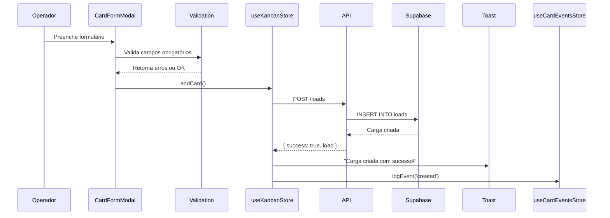

**Campos Obrigatórios:**
- title (mín 3 caracteres)
- origin (mín 3 caracteres)
- destination (mín 3 caracteres)
- value (número positivo)

**Resultado:**
- Card aparece na coluna "Cadastro"
- Status inicial: `column_id = 'registration'`
- Evento registrado no histórico

---

### 2. DIVULGAÇÃO (Broadcast)
**Ação:** Operador seleciona ou cria grupo WhatsApp

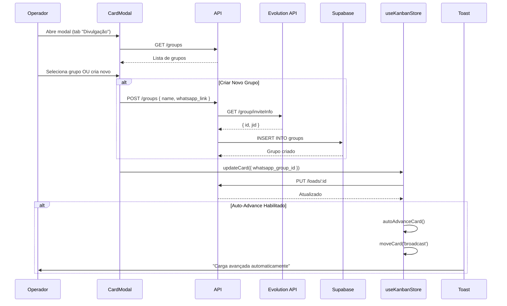

**Condição de Auto-Advance:**
- `whatsapp_group_id` deve estar presente

**Ação Manual:**
- Enviar mensagem para o grupo via Evolution API
- Marcar como `broadcast_status = 'sent'`

---

### 3. ATENDIMENTO (Initial Service)
**Ação:** Motoristas se candidatam, operador analisa

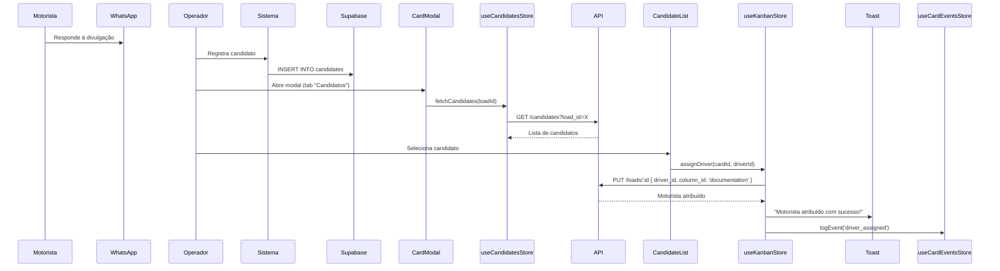

**Condição de Auto-Advance:**
- `driver` deve estar atribuído

**Estado após atribuição:**
- Card move para "Documentação"
- Candidato marcado como `selected`

---

### 4. DOCUMENTAÇÃO (Documentation)
**Ação:** Verificar documentos do motorista

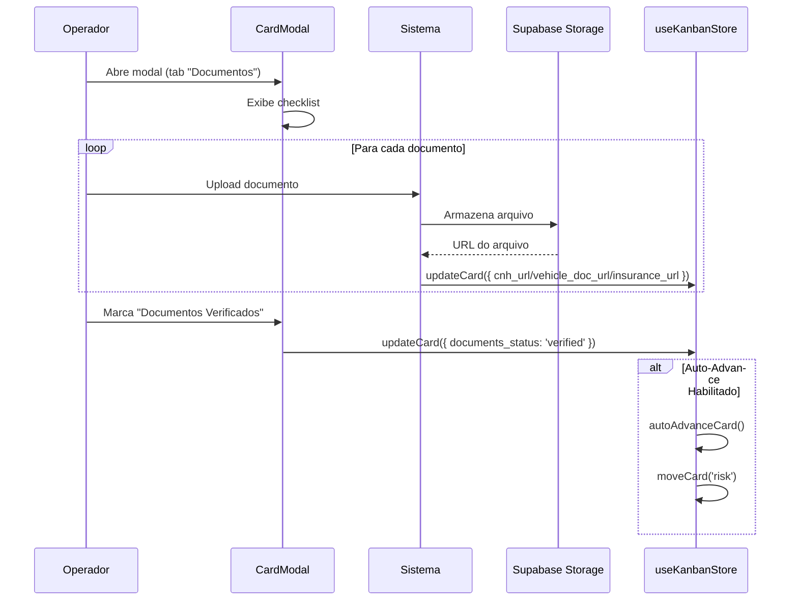

**Documentos Obrigatórios:**
- CNH (cnh_url)
- Documento do veículo (vehicle_doc_url)
- Seguro (insurance_url)

**Condição de Auto-Advance:**
- `documents_status = 'verified'`

---

### 5. RISCO (Risk)
**Ação:** Análise de risco da operação

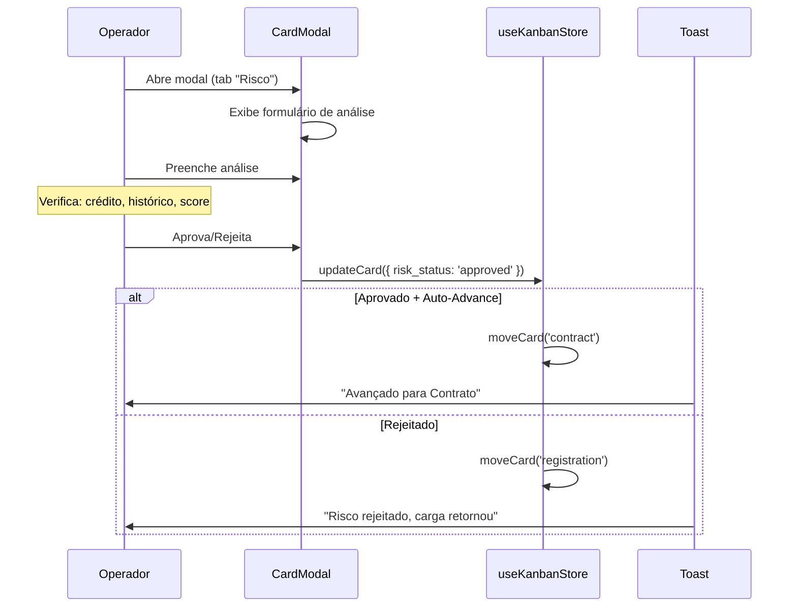

**Condição de Auto-Advance:**
- `risk_status = 'approved'`

**Possíveis Status:**
- pending
- approved
- rejected

---

### 6. CONTRATO (Contract)
**Ação:** Gerar e assinar contrato

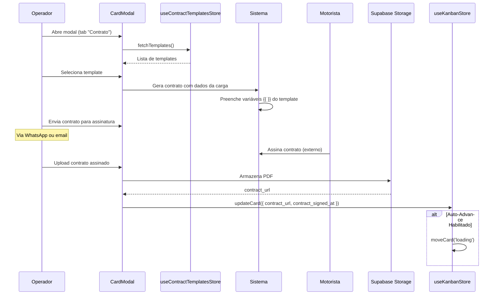

**Condição de Auto-Advance:**
- `contract_url` presente

**Templates Disponíveis:**
- Contrato de Frete Lotação
- Contrato de Frete Fracionado
- Contrato com Agregado

---

### 7. CARREGAMENTO (Loading)
**Ação:** Registrar check-in de carregamento

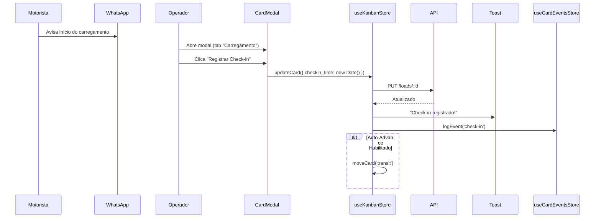

**Condição de Auto-Advance:**
- `checkin_time` presente

**Informações Registradas:**
- Data/hora do check-in
- Localização (se disponível)
- Foto do carregamento (opcional)

---

### 8. EM TRÂNSITO (Transit)
**Ação:** Monitorar carga em rota

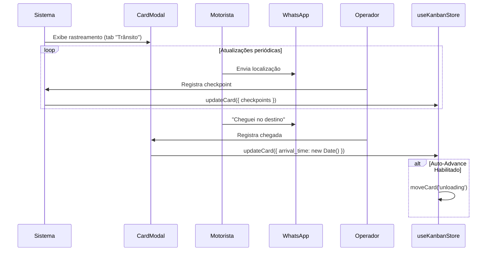

**Condição de Auto-Advance:**
- `arrival_time` presente

**Monitoramento:**
- Status da viagem
- ETA (tempo estimado de chegada)
- Desvios de rota
- Paradas não programadas

---

### 9. DESCARGA (Unloading)
**Ação:** Confirmar entrega e obter POD

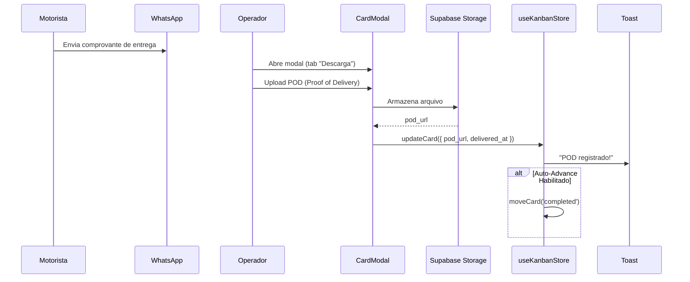

**Condição de Auto-Advance:**
- `pod_url` presente

**POD (Proof of Delivery):**
- Foto do canhoto assinado
- Nota fiscal conferida
- Protocolo de recebimento

---

### 10. FINALIZADO (Completed)
**Ação:** Processar pagamento ao motorista

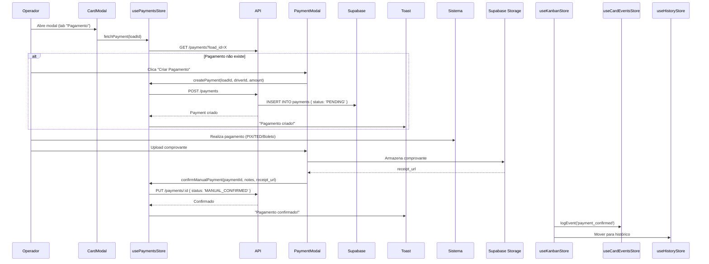

**Status de Pagamento:**
- PENDING - Aguardando pagamento
- PROCESSING - Em processamento
- MANUAL_CONFIRMED - Confirmado manualmente
- COMPLETED - Pago automaticamente
- FAILED - Falhou

**Fim do Ciclo:**
- Carga permanece em "Finalizado"
- Pode ser arquivada manualmente
- Dados movidos para relatórios

---

## 🔄 Fluxo de Auto-Advance

### Decisão de Avanço Automático

```typescript
// useKanbanStore.ts - autoAdvanceCard()

const transitions: Record<string, TransitionRule> = {
  'registration': {
    next: 'broadcast',
    condition: () => !!card.whatsapp_group_id
  },
  'broadcast': {
    next: 'initial_service',
    condition: () => card.broadcast_status === 'sent'
  },
  'initial_service': {
    next: 'documentation',
    condition: () => !!card.driver
  },
  'documentation': {
    next: 'risk',
    condition: () => card.documents_status === 'verified'
  },
  'risk': {
    next: 'contract',
    condition: () => card.risk_status === 'approved'
  },
  'contract': {
    next: 'loading',
    condition: () => !!card.contract_url
  },
  'loading': {
    next: 'transit',
    condition: () => !!card.checkin_time
  },
  'transit': {
    next: 'unloading',
    condition: () => !!card.arrival_time
  },
  'unloading': {
    next: 'completed',
    condition: () => !!card.pod_url
  }
}

// Verificar condição e avançar
if (card.auto_advance && transition.condition()) {
  await moveCard(cardId, transition.next)
  toast.success(`Avançado para ${transition.next}`)
}
```

### Triggers de Auto-Advance

O auto-advance pode ser acionado por:
1. **Atualização de campo** - updateCard()
2. **Atribuição de motorista** - assignDriver()
3. **Upload de arquivo** - contract_url, pod_url, etc.
4. **Mudança de status** - broadcast_status, risk_status, etc.

---

## 👤 Fluxo de Autenticação

### Login

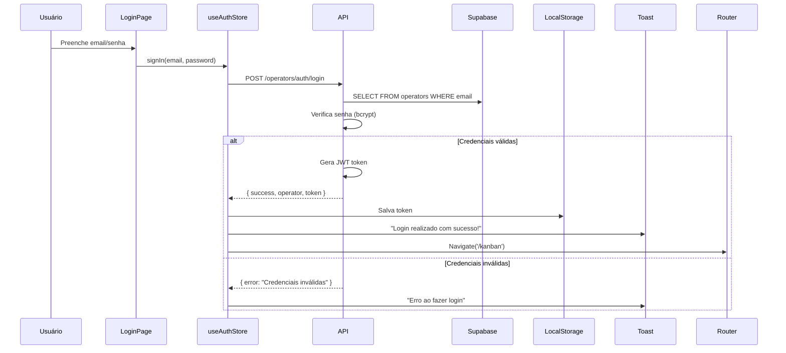

### Verificação de Sessão (ao carregar app)

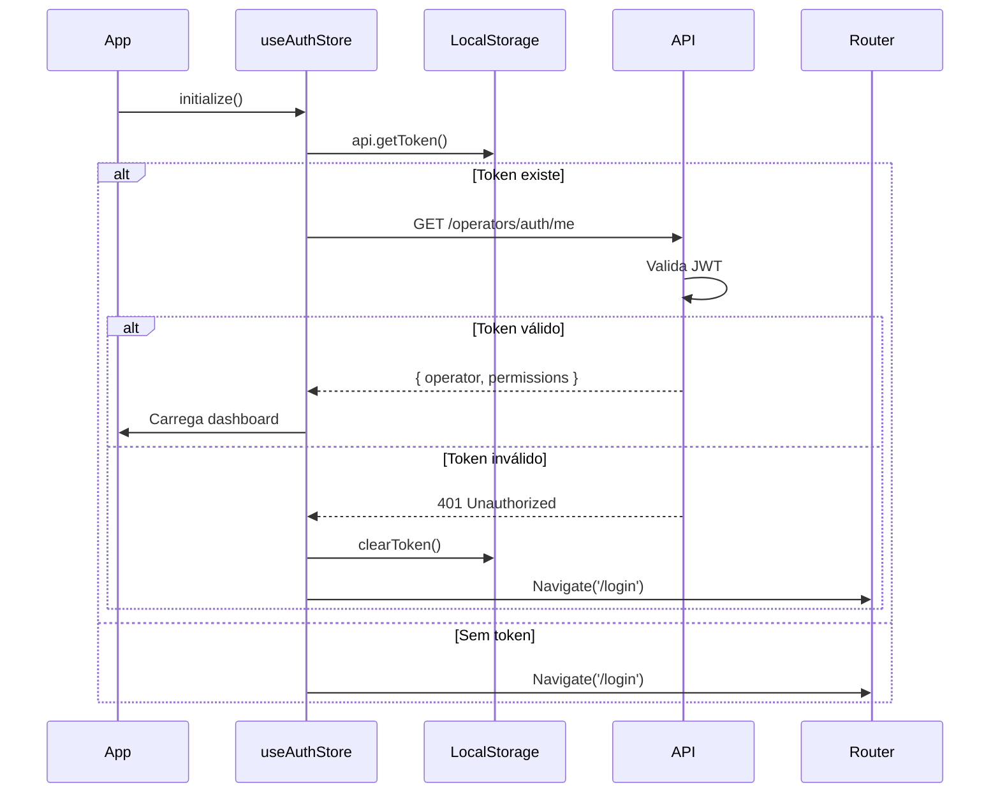

### Logout

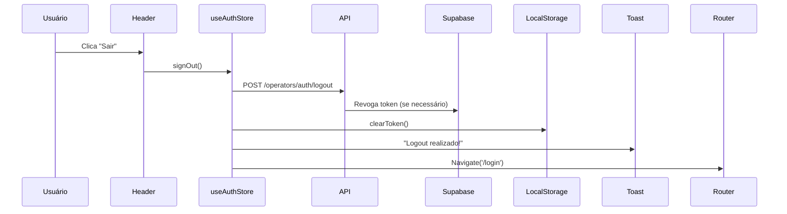

---

## 📱 Fluxo de Notificações Toast

### Quando Usar Toast

```typescript
// ✅ Sucesso em operações
toast.success('Carga criada com sucesso!')
toast.success('Motorista atribuído!')
toast.success('Pagamento confirmado!')

// ❌ Erros em operações
toast.error('Erro ao criar carga')
toast.error('Falha na conexão')
toast.error('Validação falhou')

// ⚠️ Avisos importantes
toast.warning('Documentos pendentes')
toast.warning('Prazo próximo do vencimento')

// ℹ️ Informações
toast.info('Auto-advance habilitado')
toast.info('Sincronizando dados...')
```

### Ciclo de Vida do Toast

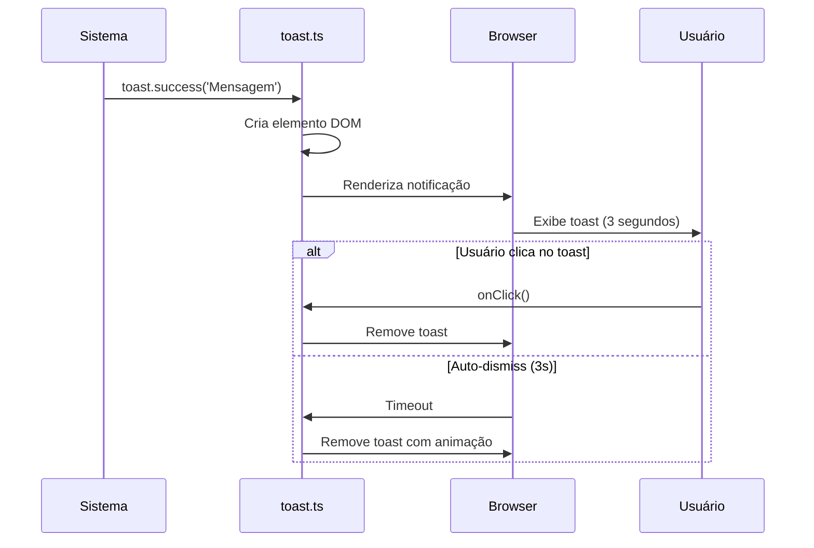

---

## 🔍 Fluxo de Validação

### Validação de Formulário

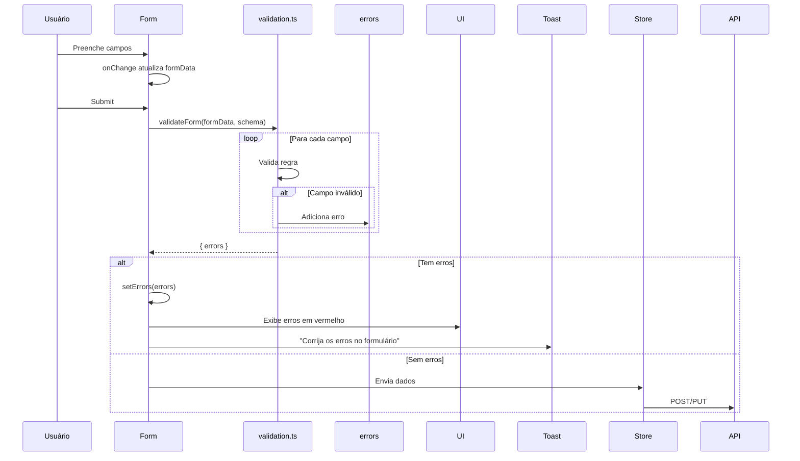

### Validações Disponíveis

```typescript
// validation.ts - Regras disponíveis

const schema = {
  name: {
    required: true,           // Campo obrigatório
    minLength: 3,            // Mínimo 3 caracteres
    maxLength: 100           // Máximo 100 caracteres
  },
  email: {
    required: true,
    email: true              // Valida formato email
  },
  cpf: {
    required: true,
    cpf: true                // Valida CPF com dígitos verificadores
  },
  cnpj: {
    cnpj: true               // Valida CNPJ
  },
  phone: {
    required: true,
    phone: true              // Valida telefone brasileiro
  },
  value: {
    required: true,
    number: true,            // Valida número
    min: 0                   // Valor mínimo
  },
  whatsappLink: {
    pattern: /^https:\/\/chat\.whatsapp\.com\//  // Regex customizado
  }
}
```

---

## 🎨 Fluxo de Drag & Drop (Kanban)

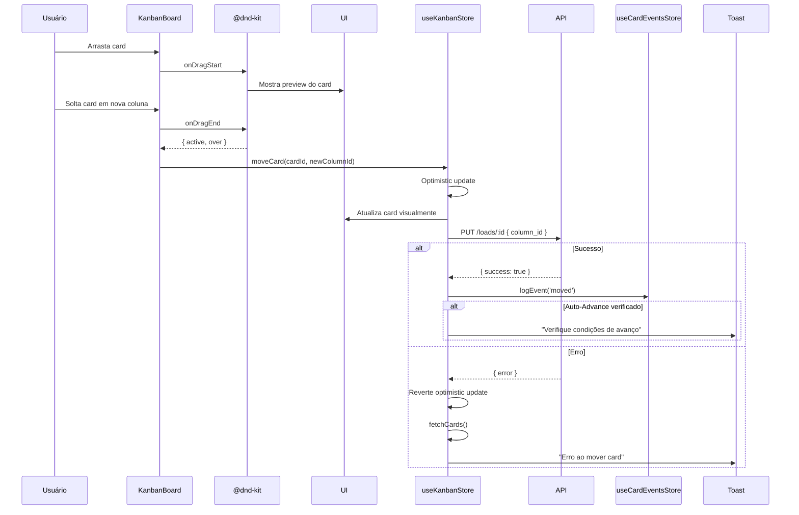

---

**Versão:** 1.0.0
**Última atualização:** 2025-01-15
